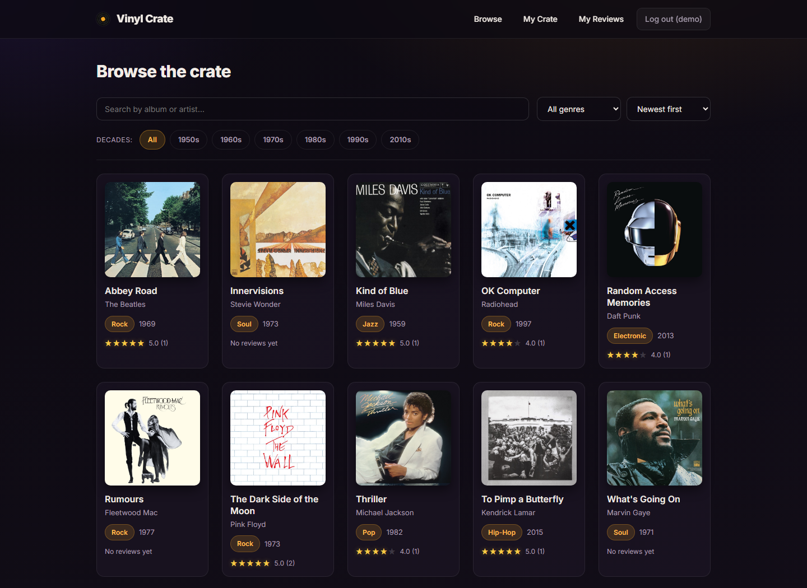
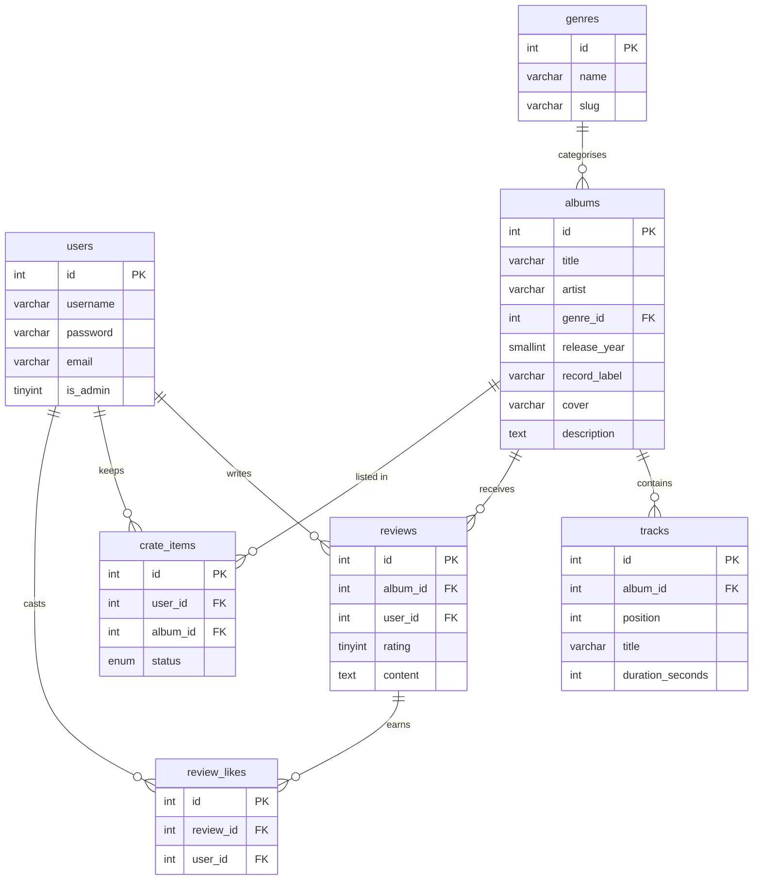
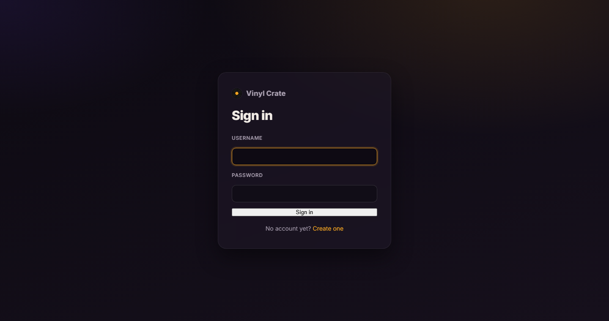
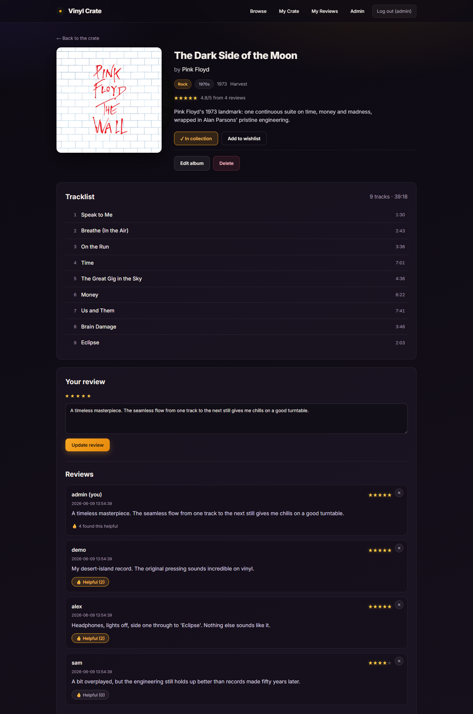
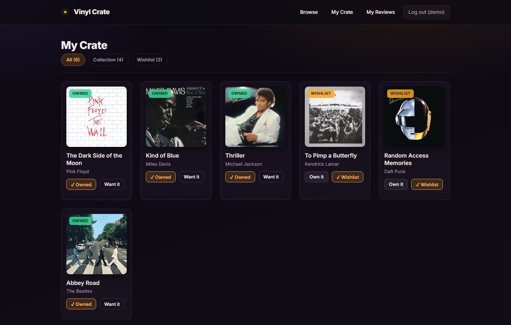
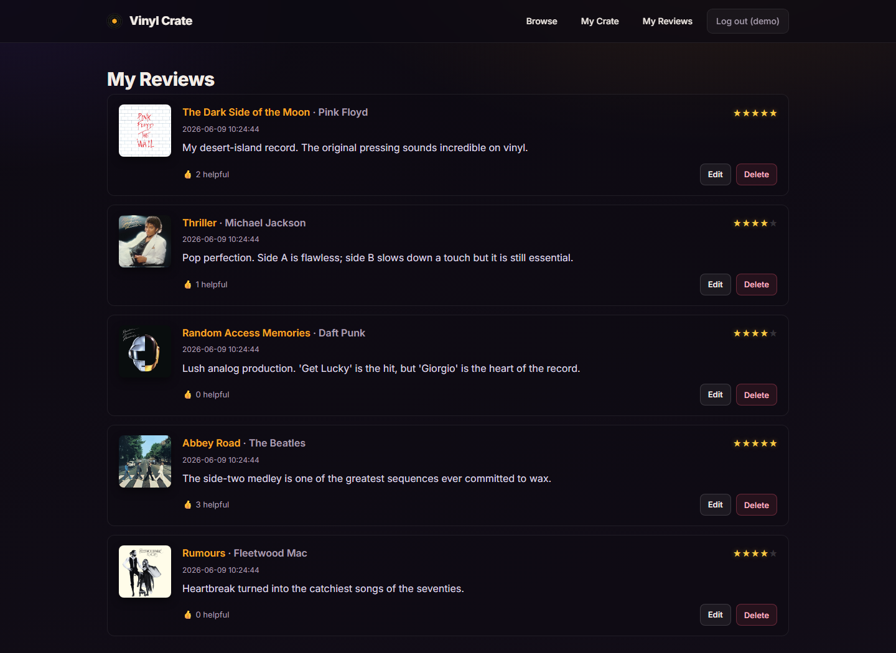
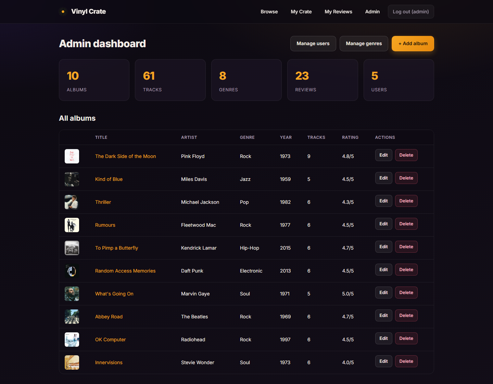
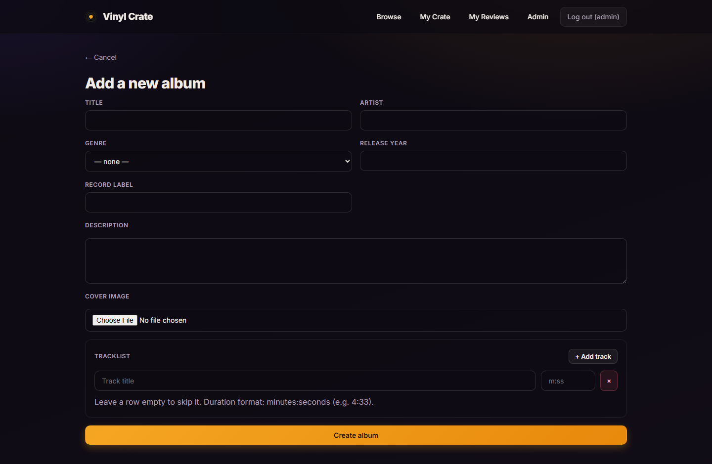
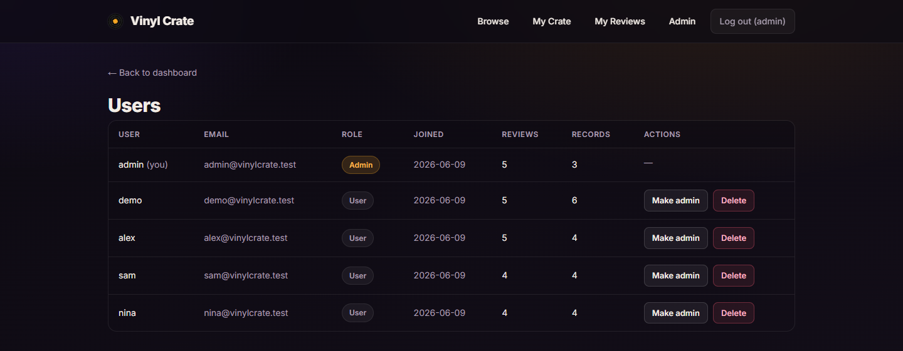
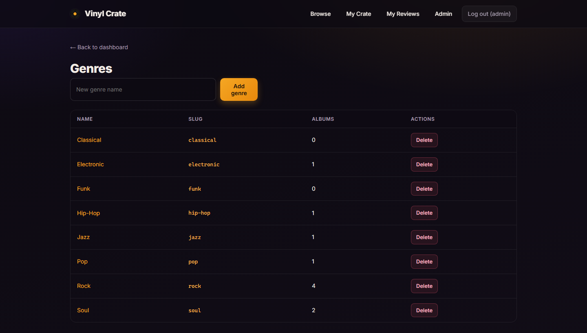

# Vinyl Crate

A web application for vinyl record collectors: browse a catalogue of albums, read and write reviews, and keep a personal crate of records you **own** or **want**. Built as the individual final project for the *Fundamentals of Web Technologies* course.

**Author:** Mehmet Demirci
**Repository:** https://github.com/mdemrc/vinyl-crate



## Introduction

Vinyl Crate is a small social catalogue for record collectors. Visitors register an account, browse albums by genre, decade or artist, open an album to see its full tracklist and reviews, rate records from one to five stars, and build a personal collection split between **owned** records and a **wishlist**. Administrators manage the catalogue (albums, tracklists, cover images and genres) through a dedicated panel.

The application is written in plain PHP with a MySQL database and a light layer of jQuery for the asynchronous features, so it runs on a standard XAMPP/Apache stack with no build step.

## Features

**Accounts**
- Registration, login and logout with password hashing (`password_hash` / `password_verify`)
- Two roles: regular users and administrators

**Catalogue & navigation**
- Responsive album grid with cover art, genre, year and average rating
- Live phrase search by album title or artist (AJAX, no page reload)
- Filtering by genre (dropdown), by decade (links) and by artist (links)
- Sorting by newest, top rated, release year or title
- Quick navigation: a genre badge or artist name links straight to the filtered catalogue

**Albums (full CRUD, admin)**
- Create, edit and delete albums
- **Real image upload** for cover art, validated by type and size, stored on disk
- A dynamic tracklist editor (add / remove track rows) saved as related rows

**Topic features**
- Per-album tracklist with positions and running time
- Reviews with a 1–5 star rating (one review per user per album, editable)
- Mark other members' reviews as **helpful**; reviews are ordered by how helpful they are
- Personal **crate**: mark records as *owned* or *wishlist*, with live toggling

**Admin panel**
- Dashboard with catalogue statistics
- Album management table and genre management (add / delete)
- **User management**: promote or demote administrators and remove accounts (with self-lockout protection)
- **Review moderation**: delete any member's review directly from the album page

**Asynchronous (AJAX) features**
- Live search, crate owned/wishlist toggle, marking a review helpful, and review deletion — all without a reload

## Tech stack

| Layer | Technology |
|-------|------------|
| Markup & style | HTML5, CSS3 (custom dark "vinyl" theme) |
| Client logic | JavaScript, jQuery 3.7 |
| Server | PHP 8 (mysqli, prepared statements) |
| Database | MySQL / MariaDB |
| Server stack | Apache (XAMPP) |

## Database schema

Seven related tables; `users` and `genres` are referenced by the rest through foreign keys.



- `albums.genre_id` → `genres.id` (`ON DELETE SET NULL`)
- `tracks.album_id` → `albums.id` (`ON DELETE CASCADE`)
- `reviews.album_id` / `reviews.user_id` → `albums` / `users` (`CASCADE`), unique per `(album_id, user_id)`
- `crate_items.user_id` / `crate_items.album_id` → `users` / `albums` (`CASCADE`), unique per `(user_id, album_id)`
- `review_likes.review_id` / `review_likes.user_id` → `reviews` / `users` (`CASCADE`), unique per `(review_id, user_id)`

## Running the project

1. Install [XAMPP](https://www.apachefriends.org/) and start **Apache** and **MySQL**.
2. Copy this folder into `xampp/htdocs/` (for example `xampp/htdocs/vinyl_crate`).
3. If your MySQL `root` password is not `123456`, set it in **`db.php`** (and it is auto-detected by `db_rebuild.php`).
4. Open `http://localhost/vinyl_crate/db_rebuild.php` once to create the database and load the sample data.
5. Open `http://localhost/vinyl_crate/` and sign in.

### Test accounts

| Role | Username | Password |
|------|----------|----------|
| Administrator | `admin` | `admin123` |
| Regular user | `demo` | `demo123` |

## Project structure

```
vinyl_crate/
├── db.php / db_rebuild.php      # connection + schema and seed
├── session.php / admin_guard.php # access guards
├── functions.php / header.php   # helpers + shared layout
├── registration.php / login.php / logout.php
├── index.php / details.php      # catalogue + album page
├── album_form.php / album_save.php / delete_album.php  # album CRUD + upload
├── crate.php / my_reviews.php   # personal collection + reviews
├── insert_review.php
├── search_ajax.php / toggle_crate.php / delete_review_ajax.php / toggle_review_like.php  # AJAX endpoints
├── admin.php / manage_genres.php / manage_users.php
├── styles/style.css
├── scripts/app.js
└── covers/                      # seed covers + uploaded images
```

## Screenshots

| Sign in | Album details |
|---------|---------------|
|  |  |

| My Crate | My Reviews |
|----------|------------|
|  |  |

| Admin dashboard | Add album (upload + tracklist) |
|-----------------|--------------------------------|
|  |  |

| Manage users | Manage genres |
|--------------|---------------|
|  |  |
